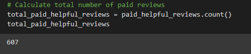
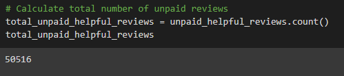
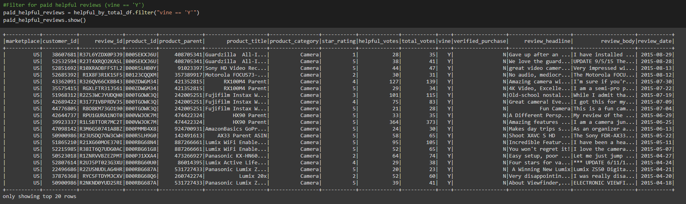
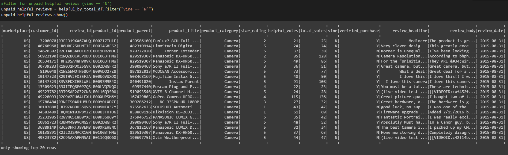
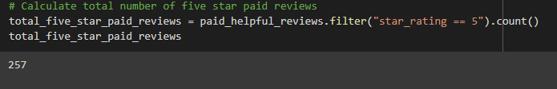
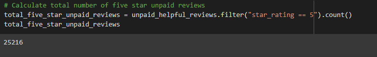
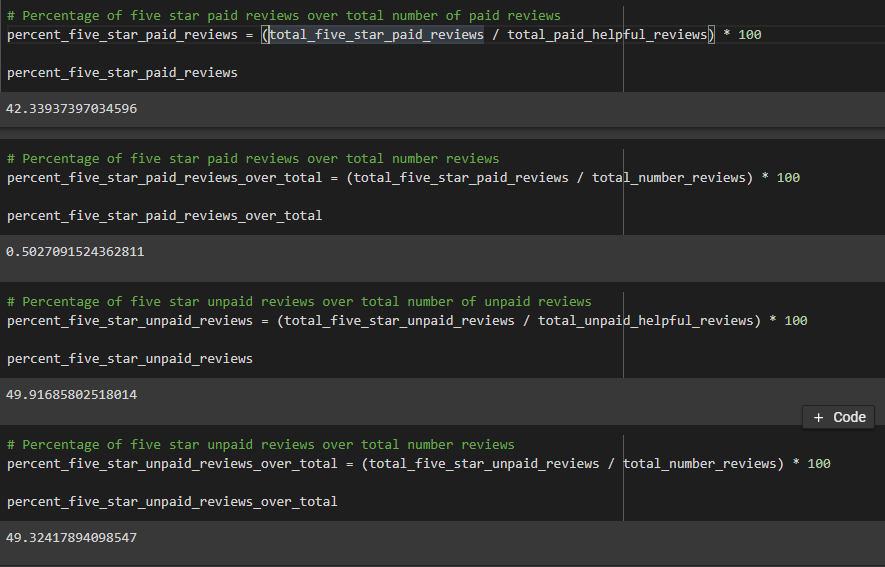

# Amazon_Vine_Analysis

## Overview of the analysis of the Vine program
 
The purpose of this project is to analyze Amazon reviews written by the members of the paid Amazon Vine Program. This program is a service that provides Amazon Vine members products to review in return for the product itself. We would like to determine whether there are any bias towards favorable  revies from Vine members in our data.

## Results

We first filtered the data set to only reviews with 20 or more votes and with 50% or more helpful votes per total votes. See the screen shot(s) below.

- How many Vine reviews and non-Vine reviews were there?
 
There are a total of 607 Vine reviews and 50516 non-Vine reviews. See the screen shot(s) below.
 

- How many Vine reviews were 5 stars? How many non-Vine reviews were 5 stars?
 
There are 257 five star Vine reviews and 25216 five star non-Vine reviews. See the screen shot(s) below.
 

- What percentage of Vine reviews were 5 stars? What percentage of non-Vine reviews were 5 stars?

 As seen from the screenshot above, 42.34% of all the Vine reviews are 5 stars rated and 49.92% of the all non-Vine reviews are 5 star rated. 5 star Vine reviews are only 0.50% of all the total reviews and 5 star non-Vine reviews are 49.32% of all the total reviews.
 
 
## Summary 
With the results above, we can see that there is no strong positivity bias for reviews in the Vine program. As we see, 42.34% of all the useful Vine reviews are 5 star rated and 49.92% of the non Vine reviews are 5 star rated. This shows that although Vine members are being paid to review the products, they are less likely to give a 5 star rating for the product than non-Vine members. This in fact shows a counter to the argument.
