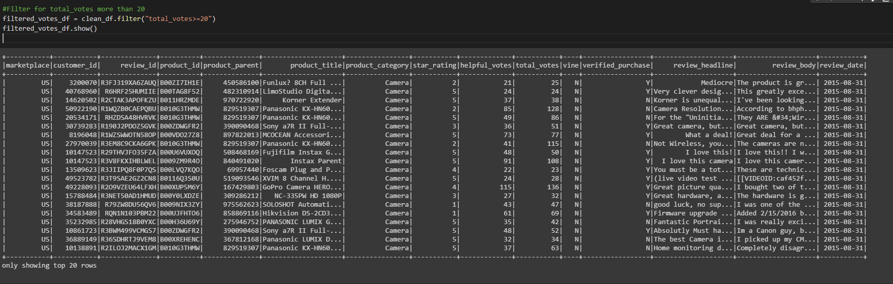
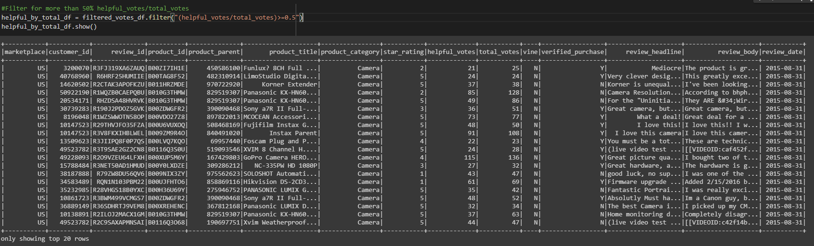

# Amazon_Vine_Analysis

## Overview of the analysis of the Vine program
 
The purpose of this project is to analyze Amazon reviews written by the members of the paid Amazon Vine Program. This program is a service that provides Amazon Vine members products to review in return for the product itself. We would like to determine whether there are any bias towards favorable  revies from Vine members in our data.

## Results

We first filtered the data set to only reviews with 20 or more votes and with 50% or more helpful votes per total votes. See the screen shot(s) below.

- How many Vine reviews and non-Vine reviews were there?
 
There are a total of 607 Vine reviews and 50516 non-Vine reviews. See the screen shot(s) below.

- How many Vine reviews were 5 stars? How many non-Vine reviews were 5 stars?

- What percentage of Vine reviews were 5 stars? What percentage of non-Vine reviews were 5 stars?
